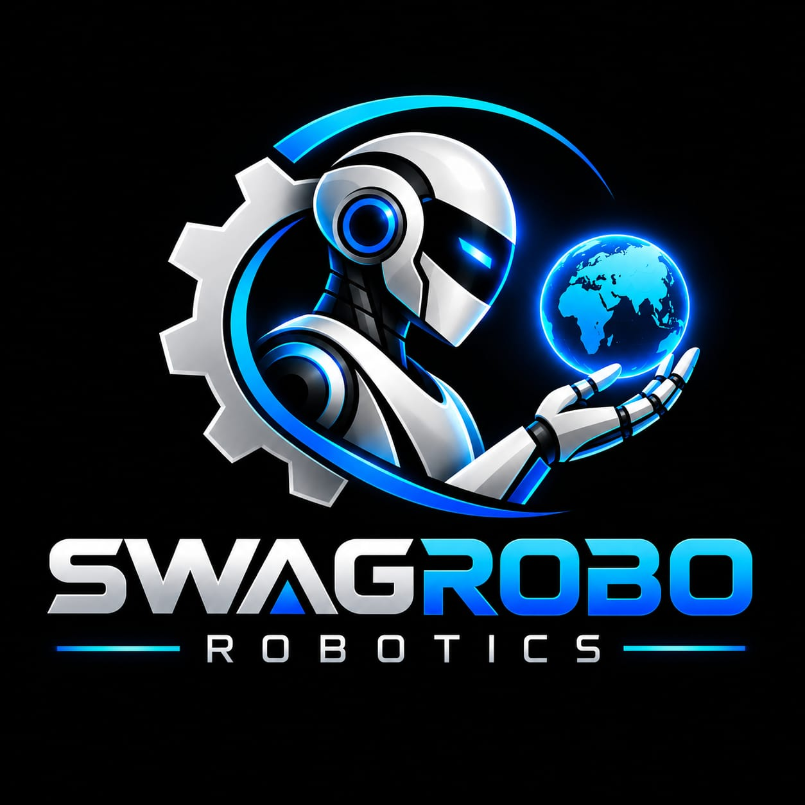

<div align="center">



# 👋 Hi, I'm Altaf Attar

### 🚀 Engineer • Developer • Robotics & AI Enthusiast

**Building real-world technology through AI, robotics, automation & software.**

</div>

---

## 🧑‍💻 About Me

I build practical technology projects that combine **software, electronics, robotics, automation, and AI**.

I enjoy turning ideas into working prototypes — from **Arduino and ESP32 robots** to **autonomous systems, Python applications, Flutter apps, and AI-powered tools**.

- 🤖 Robotics & Autonomous Systems
- 🧠 Artificial Intelligence & RAG
- ⚡ Embedded Systems & IoT
- 🐍 Python Development
- 📱 Flutter Application Development
- 🌐 Web Application Development
- 🔧 Arduino & ESP32 Projects

---

## 🚀 Featured Projects

### 🤖 Robotics & Automation

**🚗 Autonomous Rover**  
Multi-wheel robotic platform designed for autonomous movement and obstacle handling.

**🚤 Autonomous Boat**  
Autonomous navigation and monitoring system for a robotic boat.

**🧩 Maze Solver Robot**  
Sensor-based robot designed to detect and navigate maze paths.

**🤖 Emotion Robot**  
Interactive robot combining movement, sensors and human-like expressions.

---

### 🧠 AI & Software

**🌾 KrishiSaarthi AI**  
Document-grounded AI assistant designed to provide agriculture-related information from a knowledge base.

**📄 FileConverter**  
Application for PDF and image conversion, compression and document processing.

**⚡ HESCOM Employee System**  
Employee and vacancy management system with structured records and database management.

---

## 🛠️ Tech Stack

### 💻 Programming


### 📱 App & Web Development


### 🤖 Hardware & Robotics


### 🗄️ Databases & Tools


---

## 📊 GitHub Statistics

<div align="center">


</div>

---

## 🔥 Contribution Streak

<div align="center">


</div>

---

## 📌 Currently Working On

```text
🤖 ROBOTICS
├── Autonomous Rover
├── Maze Solver Robot
├── Autonomous Boat
└── Interactive Robots

🧠 ARTIFICIAL INTELLIGENCE
├── RAG Applications
├── AI Assistants
└── Agriculture AI

💻 SOFTWARE
├── Python Applications
├── Flutter Apps
└── Web Applications

⚡ EMBEDDED SYSTEMS
├── Arduino
├── ESP32
├── Sensors
└── IoT
